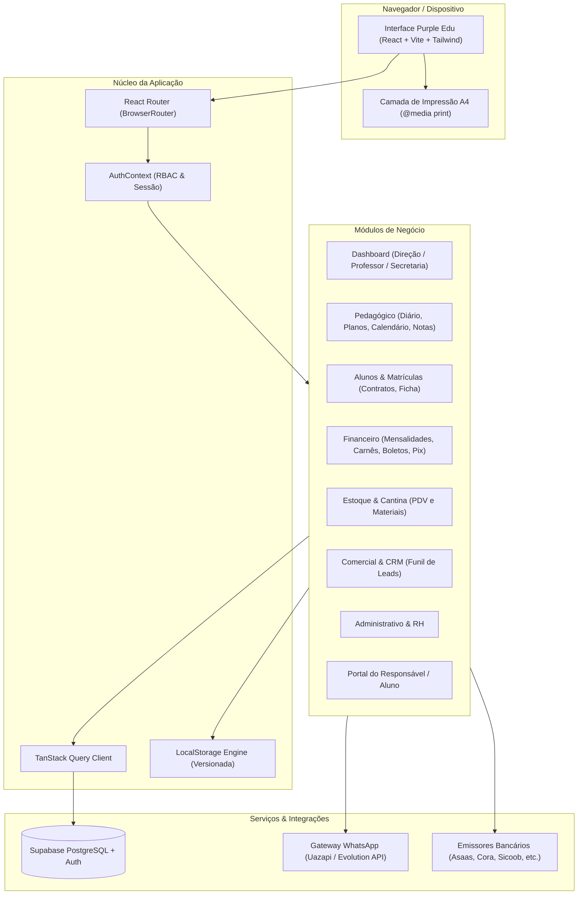
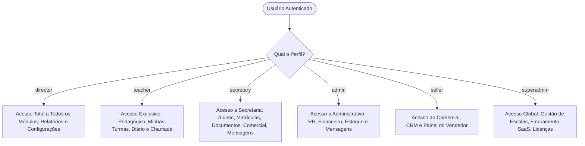
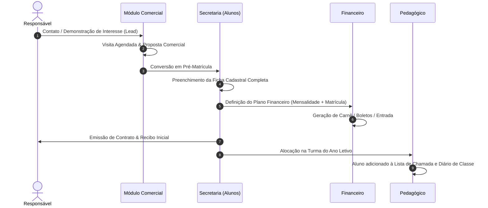
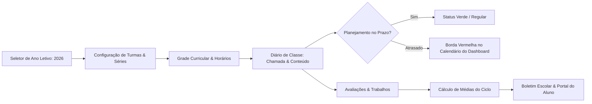
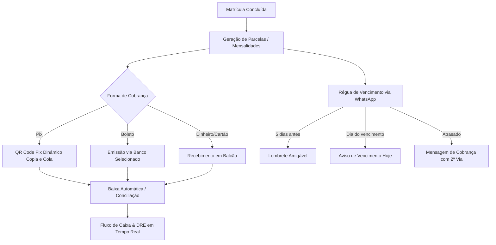

# 🎓 Purple Edu — Sistema de Gestão Escolar Completa (ERP SaaS)

> [!NOTE]
> Este documento foi formatado especialmente para leitura e navegação no **Obsidian**, utilizando Markdown rico, Callouts, Diagramas Mermaid dinâmicos e referências diretas à estrutura do código-fonte.

---

## 📑 Sumário

- [[#1. Visão Geral do Projeto|1. Visão Geral do Projeto]]
- [[#2. Stack Tecnológica|2. Stack Tecnológica]]
- [[#3. Arquitetura do Sistema e Diagramas|3. Arquitetura do Sistema e Diagramas]]
  - [[#3.1 Diagrama de Arquitetura Global|3.1 Diagrama de Arquitetura Global]]
  - [[#3.2 Diagrama de Controle de Acesso (RBAC)|3.2 Diagrama de Controle de Acesso (RBAC)]]
  - [[#3.3 Ciclo de Vida do Aluno & Matrícula|3.3 Ciclo de Vida do Aluno & Matrícula]]
  - [[#3.4 Ciclo Pedagógico & Diário de Classe|3.4 Ciclo Pedagógico & Diário de Classe]]
  - [[#3.5 Fluxo Financeiro & Cobrança|3.5 Fluxo Financeiro & Cobrança]]
- [[#4. Estrutura de Diretórios|4. Estrutura de Diretórios]]
- [[#5. Módulos do Sistema e Regras de Negócio|5. Módulos do Sistema e Regras de Negócio]]
  - [[#5.1 Autenticação e Perfis (RBAC)|5.1 Autenticação e Perfis (RBAC)]]
  - [[#5.2 Dashboard (Multi-Visão)|5.2 Dashboard (Multi-Visão)]]
  - [[#5.3 Módulo Pedagógico|5.3 Módulo Pedagógico]]
    - [[#Diário de Classe com Dados Verídicos|Diário de Classe com Dados Verídicos]]
    - [[#Planejamento de Aulas & Detecção de Atrasos|Planejamento de Aulas & Detecção de Atrasos]]
    - [[#Avaliações, Notas & Ciclos de Médias|Avaliações, Notas & Ciclos de Médias]]
    - [[#Turmas, Matérias & Grade Horária|Turmas, Matérias & Grade Horária]]
    - [[#Calendário Escolar Oficial & Impressão Anual|Calendário Escolar Oficial & Impressão Anual]]
  - [[#5.4 Módulo de Alunos e Secretaria|5.4 Módulo de Alunos e Secretaria]]
  - [[#5.5 Módulo Financeiro & Cobrança|5.5 Módulo Financeiro & Cobrança]]
  - [[#5.6 Módulo de Estoque, Uniformes & Cantina|5.6 Módulo de Estoque, Uniformes & Cantina]]
  - [[#5.7 Módulo Comercial & CRM de Matrículas|5.7 Módulo Comercial & CRM de Matrículas]]
  - [[#5.8 Módulo Administrativo & RH|5.8 Módulo Administrativo & RH]]
  - [[#5.9 Portal do Responsável e Aluno|5.9 Portal do Responsável e Aluno]]
  - [[#5.10 Configurações Globais & Multi-Sedes|5.10 Configurações Globais & Multi-Sedes]]
  - [[#5.11 Painel Super Admin (SaaS Billing)|5.11 Painel Super Admin (SaaS Billing)]]
- [[#6. Modelagem de Dados & Tipagem TypeScript|6. Modelagem de Dados & Tipagem TypeScript]]
- [[#7. Gerenciamento de Estado & Armazenamento Híbrido|7. Gerenciamento de Estado & Armazenamento Híbrido]]
- [[#8. Guia de Instalação e Execução|8. Guia de Instalação e Execução]]
- [[#9. Padrões de Código e Guia de Contribuição|9. Padrões de Código e Guia de Contribuição]]

---

## 1. Visão Geral do Projeto

O **Purple Edu** (também denominado *Colégio Interagir ERP* ou *Escolinha ERP*) é uma solução corporativa SaaS desenvolvida para gestão ponta a ponta de instituições de ensino básico (Educação Infantil, Ensino Fundamental 1 e 2, e Ensino Médio).

### Objetivos Centrais
- **Centralização Operacional**: Conectar pedagogos, professores, secretaria, financeiro, marketing e direção em uma única interface responsiva.
- **Rigor Pedagógico**: Controle de presença real, planos de aula com detecção visual de atrasos, cálculo automatizado de médias bimestrais/trimestrais e calendário escolar homologado.
- **Automação Financeira**: Emissão de carnês, boletos bancários (múltiplos bancos emissores), QR Code Pix dinâmico e régua de cobrança automática via WhatsApp.
- **Multi-Unidade (Sedes)**: Operação simultânea com múltiplas filiais/sedes (`Senador`, `Papagaio`, etc.) sob o mesmo tenant ou consolidadas.
- **Documentação Oficial com 1 Clique**: Contratos de matrícula customizados com tags dinâmicas, carteirinhas, declarações de frequência, recibos de pagamento e calendário anual para impressão A4.

---

## 2. Stack Tecnológica

| Camada | Tecnologia | Propósito / Detalhes |
| :--- | :--- | :--- |
| **Framework Base** | [[React]] 18.3.1 | Biblioteca reativa com renderização otimizada por componentes. |
| **Bundler / Build** | [[Vite]] 5.4 | Empacotamento ultrarrápido com Hot Module Replacement (HMR). |
| **Linguagem** | [[TypeScript]] 5.8 | Tipagem estática rigorosa para segurança e previsibilidade. |
| **Estilização** | [[TailwindCSS]] 3.4 | Utilitários CSS, animações customizadas e suporte a `@media print`. |
| **Design System** | [[shadcn/ui]] + [[Radix UI]] | Componentes acessíveis, modais, tooltips, switches, selects e dropdowns. |
| **Ícones** | [[Lucide React]] | Mais de 400 ícones vetoriais modernos e consistentes. |
| **Gráficos** | [[Recharts]] 2.15 | Visualização de dados (fluxo de caixa, evasão, presença, médias). |
| **Manipulação de Datas** | [[date-fns]] 3.6 | Cálculos de intervalos, feriados, formatação em português (`pt-BR`). |
| **Gerenciamento de Estado** | [[TanStack Query]] v5 | Cache e revalidação de dados remotos. |
| **Backend / BaaS** | [[Supabase]] (PostgreSQL) | Autenticação, banco de dados relacional e Row Level Security (RLS). |
| **Notificações** | [[Sonner]] + Radix Toast | Feedback visual de sucesso, erro e alertas flutuantes. |
| **Geração de PDF** | [[jsPDF]] + [[jspdf-autotable]] | Renderização e exportação de recibos e relatórios em PDF. |
| **Exportação de Dados** | [[xlsx]] | Planilhas Excel com relatórios contábeis, notas e listas de alunos. |

---

## 3. Arquitetura do Sistema e Diagramas

### 3.1 Diagrama de Arquitetura Global



---

### 3.2 Diagrama de Controle de Acesso (RBAC)

O sistema aplica rigoroso controle de acesso com base no perfil ativo do usuário (`AppRole`):



---

### 3.3 Ciclo de Vida do Aluno & Matrícula



---

### 3.4 Ciclo Pedagógico & Diário de Classe



---

### 3.5 Fluxo Financeiro & Cobrança



---

## 4. Estrutura de Diretórios

```
escolinha/
├── public/                     # Favicons, assets públicos e logos
├── src/
│   ├── assets/                 # Imagens, fotos e recursos visuais empacotados
│   ├── components/             # Componentes modulares reutilizáveis
│   │   ├── administrativo/     # Colaboradores, cargos, folha de ponto
│   │   ├── alunos/             # Ficha do aluno, modal de documentos e recibos
│   │   ├── comercial/          # Funil de vendas Kanban, agendamento de visitas
│   │   ├── common/             # Logo, YearSelector, componentes compartilhados
│   │   ├── dashboard/          # TeacherDashboard, SecretaryDashboard, KPIs
│   │   ├── estoque/            # Gestão de uniformes, cantina, PDV e recibo de venda
│   │   ├── financeiro/         # Mensalidades, carnês, Pix modal, DRE, conciliação
│   │   ├── layout/             # AppLayout, AppSidebar, Topbar, PageHeader
│   │   ├── onboarding/         # Modais de primeiro acesso e boas-vindas
│   │   ├── pedagogico/         # Diário, Planejamento, Avaliações, Calendário Escolar
│   │   ├── portal/             # Layout e visualizações do Portal do Responsável
│   │   ├── settings/           # Configurações de sedes, WhatsApp, documentos
│   │   ├── superadmin/         # Gestão SaaS, paywall e assinaturas de escolas
│   │   └── ui/                 # Primitivos shadcn/ui (Button, Dialog, Card, Input)
│   ├── constants/              # Turmas padrão, feriados fixos, configurações iniciais
│   ├── contexts/               # AuthContext e provedores globais de estado
│   ├── hooks/                  # Custom hooks (useLocalStorage, useSedes, etc.)
│   ├── integrations/           # Clientes de APIs externas (Supabase client)
│   ├── lib/                    # Funções utilitárias de classes (cn, tailwind-merge)
│   ├── pages/                  # Páginas principais correspondentes às rotas
│   │   ├── portal/             # Páginas dedicadas ao Portal do Aluno/Família
│   │   ├── Alunos.tsx          # Gestão de alunos e matrículas
│   │   ├── Comercial.tsx       # CRM e captação
│   │   ├── Configuracoes.tsx   # Painel de ajustes do sistema
│   │   ├── Dashboard.tsx       # Visão analítica geral
│   │   ├── Estoque.tsx         # Almoxarifado e cantina
│   │   ├── Financeiro.tsx      # Contas, mensalidades e carnês
│   │   ├── Landing.tsx         # Página de apresentação pública
│   │   ├── Login.tsx           # Tela de autenticação com seleção de perfis
│   │   ├── Pedagogico.tsx      # Hub pedagógico unificado
│   │   └── SuperAdmin.tsx      # Gestão master da plataforma
│   ├── services/               # Serviços de API, persistência e integrações
│   ├── types/                  # Definições completas de tipos TypeScript
│   │   ├── aluno.ts            # Tipos da ficha cadastral do aluno
│   │   ├── auth.ts             # Tipos de papéis, permissões e usuário
│   │   ├── calendarioEscolar.ts# Estrutura do calendário escolar e feriados
│   │   ├── comercial.ts        # Tipos do funil de vendas e leads
│   │   ├── documentoEscolar.ts # Templates de contratos e declarações
│   │   ├── estoque.ts          # Itens, movimentações e vendas
│   │   ├── finance.ts          # Lançamentos, orçamentos, bancos emissores
│   │   ├── pedagogico.ts       # Turmas, matérias, médias e planos
│   │   └── sede.ts             # Estrutura de filiais/sedes escolares
│   ├── utils/                  # Geradores de Pix, cálculos financeiros, datas
│   ├── App.tsx                 # Mapeamento central de rotas e providers
│   ├── index.css               # Estilos globais Tailwind e regras @media print
│   └── main.tsx                # Bootstrap da aplicação React
├── DOCUMENTACAO_SISTEMA.md     # Este documento técnico oficial
├── package.json                # Dependências e scripts do Node.js
└── vite.config.ts              # Configurações do Vite e plugins
```

---

## 5. Módulos do Sistema e Regras de Negócio

### 5.1 Autenticação e Perfis (RBAC)

O sistema opera sob o conceito de **Role-Based Access Control** gerenciado pelo `AuthContext.tsx`.

```typescript
// src/types/auth.ts
export type AppRole = 'teacher' | 'secretary' | 'admin' | 'director' | 'seller';
```

- **Mapeamento de Permissões (`ROLE_PERMISSIONS`)**:
  - `teacher`: Acesso restrito a `pedagogico`, `diario` e `turmas`.
  - `secretary`: Acesso a `secretaria`, `turmas`, `alunos`, `mensagens`, `comercial`, `estoque`.
  - `admin`: Acesso a `administrativo`, `financeiro`, `mensagens`, `comercial`, `estoque`.
  - `director`: Acesso irrestrito a todos os módulos e configurações sensíveis.
  - `seller`: Acesso focado no funil de vendas e CRM.

---

### 5.2 Dashboard (Multi-Visão)

O Dashboard adapta-se dinamicamente ao cargo do usuário logado:

1. **Visão da Diretoria (`src/pages/Dashboard.tsx`)**:
   - KPIs Globais: Total de Alunos Ativos, Faturamento Mensal, Inadimplência Geral e Taxa de Retenção.
   - **Calendário Dinâmico em Formato de Lista**:
     - Visualização cronológica dos dias do mês com marcações de eventos.
     - **Dias sem aula**: estilizados com fundo acinzentado suave e aviso de recesso/feriado.
     - **Planejamento Atrasado**: dias letivos em que o plano de aula do professor não foi lançado são destacados com uma **borda vermelha viva** e badge de alerta.
   - Gráficos comparativos de receitas x despesas com `Recharts`.
2. **Visão do Professor (`src/components/dashboard/TeacherDashboard.tsx`)**:
   - Atalhos para registrar frequência de hoje.
   - Lembretes de diários pendentes de assinatura ou preenchimento.
   - Calendário semanal com os dias de aula da turma regente.
3. **Visão da Secretaria (`src/components/dashboard/SecretaryDashboard.tsx`)**:
   - Alunos matriculados no mês, pendências de documentos e aniversariantes da semana.

---

### 5.3 Módulo Pedagógico

O coração acadêmico do sistema está encapsulado em `src/pages/Pedagogico.tsx` e subdividido em abas:

#### Diário de Classe com Dados Verídicos
- **Frequência Inteligente**: Permite marcar presença, falta justificada ou falta simples para cada estudante cadastrado.
- **Sincronização em Tempo Real**: Dados verídicos vinculados à base oficial de alunos da turma selecionada.
- **Bloqueio Automático**: Dias sinalizados como "Sem Aula" pelo Calendário Escolar são bloqueados para lançamento de chamada, evitando erros de apontamento.

#### Planejamento de Aulas & Detecção de Atrasos
- Planejamento organizado por habilidades BNCC, conteúdo programático e recursos didáticos.
- **Indicador de Atraso Pedagógico**:
  - Quando a data atual ultrapassa o período previsto para o plano sem confirmação de execução, o sistema sinaliza o atraso imediatamente tanto no diário quanto no calendário do Dashboard com borda vermelha.

#### Avaliações, Notas & Ciclos de Médias
- Suporte a múltiplos ciclos de avaliação (Bimestres, Trimestres ou Semestres).
- Tipos de cálculo configuráveis: **Média Aritmética**, **Média Ponderada** ou **Somatória Simples**.
- Notas com trava de segurança (0.0 a 10.0), recuperação paralela e conselho de classe.

#### Turmas, Matérias & Grade Horária
- Cadastro de turmas categorizadas por setor (`Educação Infantil`, `Fundamental 1`, `Fundamental 2`, `Ensino Médio`).
- Grade horária semanal com suporte a aulas divididas (sub-slots de 25/30 min para oficinas ou troca de docentes).

#### Calendário Escolar Oficial & Impressão Anual
- Gerenciamento completo de eventos letivos e dias sem aula (`src/components/pedagogico/CalendarioEscolarTab.tsx`).
- **Seletor de Público-Alvo Inteligente (Multi-Select)**:
  - Opção `"Toda a Escola"` (marca todos os públicos).
  - Opção `"Alunos em Geral"` (marca todas as turmas de estudantes).
  - Opções por turmas específicas (ex.: `1º Ano`, `2º Ano`, `5º Ano`), além de `Professores e Equipe` e `Pais e Responsáveis`.
- **Botão "Restaurar Feriados 2026"**: Carrega instantaneamente os feriados nacionais, recessos de Carnaval, Páscoa, Corpus Christi, férias de julho e recessos natalinos previstos para o ano civil.
- **Impressão Oficial em Formato Anual (A4)**:
  - Ao clicar no botão **"Imprimir"**, o sistema abre o modal de visualização do **Calendário Escolar Anual**.
  - **Grid de 12 Meses**: Exibe todos os meses de Janeiro a Dezembro em grade harmônica de 4 colunas.
  - **Filtro Estrito `@media print`**: Todos os elementos de tela capturados em tela (cabeçalhos com botões, cards de KPI, botões de paginação mensal, inputs de busca e grade mensal da tela) são ocultados com `print:hidden`.
  - **Legenda Completa com Datas e Cores**:
    - 🔴 **Vermelho**: Feriados e Recessos Escolares (Dia Sem Aula).
    - 🟠 **Laranja / Âmbar**: Paradas Pedagógicas / Planejamento Docente (Sem Aula).
    - 🟢 **Verde**: Sábados Letivos (Com Aula / Reposição).
    - 🟣 **Roxo**: Eventos Escolares & Festividades Culturais.
    - 🔵 **Azul**: Reuniões de Pais e Mestres.
    - 🔷 **Índigo**: Semanas de Provas e Avaliações.
  - **Relação Cronológica em Colunas**: Lista todas as datas do ano (`01/01`, `02 a 30/01`, `16 a 18/02`, etc.) com tag colorida correspondente, status de aula e público-alvo.
  - **Campos de Assinatura**: Espaço para carimbo e homologação da Direção e Coordenação.

---

### 5.4 Módulo de Alunos e Secretaria

- **Ficha Cadastral 360º**:
  - Dados pessoais, certidão de nascimento, RG, CPF.
  - Dados de saúde, cartão do SUS, restrições alimentares, alergias e contato de emergência.
  - Vínculo com responsáveis didáticos e financeiros.
- **Gerador de Documentos (`DocumentosImpressaoModal.tsx`)**:
  - Substituição dinâmica de tags nos contratos: `{{aluno_nome}}`, `{{aluno_cpf}}`, `{{responsavel_nome}}`, `{{valor_mensalidade}}`, `{{turma}}`.
  - Quebra de página automática para contratos de múltiplas folhas.
- **Recibos de Matrícula (`ReciboMatriculaModal.tsx`)**:
  - Comprovante de quitação com numeração de controle única e detalhamento de valores.

---

### 5.5 Módulo Financeiro & Cobrança

- **Gestão de Carnês e Mensalidades**:
  - Geração de 12 ou mais parcelas automatizadas por ano letivo.
  - Descontos de pontualidade, bolsas de estudo e acréscimos de contraturno.
- **Emissão de Pix & Boletos**:
  - Geração de QR Code Pix padrão EMV (Copia e Cola + Imagem renderizada no canvas).
  - Suporte a múltiplos bancos emissores: Asaas, Cora, Sicoob, Bradesco, Banco do Brasil, Itaú, Santander, Caixa, Inter e Nubank.
- **DRE e Fluxo de Caixa**:
  - Classificação de custos em Fixos e Variáveis.
  - Relatórios de entradas e saídas por unidade/sede e centro de custo.

---

### 5.6 Módulo de Estoque, Uniformes & Cantina

- Cadastro de produtos com controle de variações (tamanhos 2, 4, 6, P, M, G de uniformes).
- Ponto de Venda (PDV) com baixa instantânea de estoque.
- Emissão de Recibo de Venda de Estoque (`ReciboVendaEstoqueModal.tsx`).

---

### 5.7 Módulo Comercial & CRM de Matrículas

- Pipeline de Vendas em formato Kanban (`Novo Lead` ➔ `Primeiro Contato` ➔ `Visita Agendada` ➔ `Matrícula em Andamento` ➔ `Ganha / Perdida`).
- Histórico de interações por responsável com motivo de perda e agendamento de retorno.

---

### 5.8 Módulo Administrativo & RH

- Cadastro do corpo docente e equipe administrativa.
- Controle de cargos, salários e registro de faltas e atestados.

---

### 5.9 Portal do Responsável e Aluno

- Autenticação simplificada para famílias.
- Visualização de frequência semanal, tarefas de casa publicadas pelo professor e 2ª via de faturas/Pix.

---

### 5.10 Configurações Globais & Multi-Sedes

- **Seletor de Ano Letivo Ativo**: Permite alternar o contexto de todo o sistema entre 2025, 2026, 2027 etc.
- **Gerenciador de Sedes (`SedesManager.tsx` / `useSedes.ts`)**: Alternância rápida entre filiais na barra de navegação superior (Topbar).
- **Central WhatsApp (`WhatsAppInstancesManager.tsx`)**: Integração de instâncias via Evolution API / Uazapi para disparo de mensagens em massa e avisos.

---

### 5.11 Painel Super Admin (SaaS Billing)

- Monitoramento das assinaturas de cada escola cliente.
- Paywall integrado com liberação automática de acesso após confirmação de pagamento.

---

## 6. Modelagem de Dados & Tipagem TypeScript

A tabela abaixo resume as principais entidades do domínio:

| Interface | Arquivo Fonte | Descrição dos Principais Campos |
| :--- | :--- | :--- |
| `Aluno` | `src/types/aluno.ts` | `id`, `nome`, `matricula`, `status`, `cpf`, `turma`, `classe`, `endereco`, `responsaveis` |
| `Responsavel` | `src/types/aluno.ts` | `id`, `nome`, `contato`, `cpf`, `responsavelFinanceiro`, `responsavelDidatico` |
| `EventoCalendarioEscolar` | `src/types/calendarioEscolar.ts` | `id`, `titulo`, `tipo`, `dataInicio`, `dataFim`, `temAula`, `anoLetivo`, `publicoAlvo` |
| `TurmaPedagogica` | `src/types/pedagogico.ts` | `id`, `nome`, `setor`, `anoLetivo`, `turno`, `valorMensalidade`, `professorRegenteId` |
| `Lancamento` | `src/types/finance.ts` | `id`, `data`, `unidade`, `valor`, `tipo` (Entrada/Saída), `formaPagamento`, `status` |
| `UserProfile` | `src/types/auth.ts` | `id`, `school_id`, `full_name`, `avatar_url`, `phone`, `is_active` |
| `Sede` | `src/types/sede.ts` | `id`, `nome`, `endereco`, `cidade`, `ativa`, `corBadge` |

---

## 7. Gerenciamento de Estado & Armazenamento Híbrido

O sistema implementa uma arquitetura híbrida de alta resiliência:

1. **Dados em Nuvem (Supabase PostgreSQL)**:
   - Perfis de usuários, autenticação JWT, instâncias de WhatsApp e configurações do tenant.
2. **Dados em Cache Local Otimizado (`useLocalStorage`)**:
   - Garante funcionamento com resposta instantânea e suporte offline para rotinas diárias:
     - `escolinha_calendario_escolar_v1`: Eventos, feriados e dias sem aula do calendário.
     - `escolinha_ano_letivo_ativo`: Ano letivo em foco (padrão `'2026'`).
     - `escolinha_turmas_v3`: Estrutura de séries e turmas.
     - `escolinha_alunos_v2`: Lista de estudantes matriculados.
     - `escolinha_sedes_v1`: Relação de unidades ativas.
     - `escolinha_planos_aula_v1`: Registros de planejamento docente.

---

## 8. Guia de Instalação e Execução

### Pré-requisitos
- **Node.js**: versão 18.x ou superior recomendada.
- **npm** ou **yarn**.

### Passo a Passo

```bash
# 1. Clonar o repositório
git clone https://github.com/neto-prax/escolinha.git
cd escolinha

# 2. Instalar as dependências do projeto
npm install

# 3. Executar o servidor de desenvolvimento local
npm run dev

# O sistema estará acessível em: http://localhost:8080 ou http://localhost:5173
```

### Comandos de Compilação & Qualidade

```bash
# Compilar projeto para produção (Vite Build)
npm run build

# Executar linting de código
npm run lint

# Pré-visualizar a versão compilada em servidor local
npm run preview
```

---

## 9. Padrões de Código e Guia de Contribuição

### Regras de Estilização e CSS
- Use utilitários **TailwindCSS** seguindo o padrão de cores institucionais `purple` e `slate`.
- Ao criar modais ou elementos de visualização na tela, inclua `print:hidden` se esses elementos não devem ser impressos em relatórios.
- Para folhas de impressão A4 oficiais, defina sempre `@page { size: A4 portrait; margin: 8mm; }` e `-webkit-print-color-adjust: exact` para garantir fidelidade das cores em impressoras e PDFs.

### Manipulação de Datas
- Use **`date-fns`** com o locale `ptBR` para exibição de meses e semanas (`format(date, 'MMMM yyyy', { locale: ptBR })`).
- Armazene datas no padrão ISO `YYYY-MM-DD` para evitar divergências de fuso horário.

### Notificações ao Usuário
- Utilize **`toast.success('Mensagem')`** ou **`toast.error('Mensagem')`** da biblioteca `sonner` para qualquer feedback visual de operação.

---

> [!TIP]
> **Dica para o Obsidian**: Você pode abrir este arquivo diretamente em seu cofre do Obsidian para usufruir de navegação por links internos `[[...]]`, visualização gráfica dos diagramas Mermaid e índices recolhíveis.
